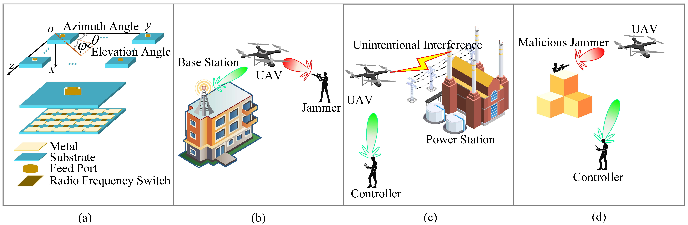

# 2025-JSAC-RadiationPatternReconfigurableAntenna

Simulation codes for our paper, titled *Radiation Pattern Reconfigurable FAS-Empowered Interference-Resilient UAV Communication*, which has been accepted by **IEEE JSAC** and is available on [arXiv](https://arxiv.org/abs/2510.00581).

<figure>
    
    <figcaption>Radiation pattern reconfigurable antenna and its application in enhancing interference-resilient UAV communications across various scenarios:
	(a) radiation pattern reconfigurable-fluid antenna system with reconfigurable pixel antennas;
	(b) networked UAVs jammed by illegal jammer;
	(c) remotely piloted UAVs interfered by unintentional interference;
	(d) remotely piloted UAVs jammed by illegal jammer.
    </figcaption>
</figure>

## Abstract
The widespread use of uncrewed aerial vehicles (UAVs) has propelled the development of advanced techniques on countering unauthorized UAV flights. 
However, the resistance of legal UAVs to illegal interference remains under-addressed. 
This paper proposes radiation pattern reconfigurable fluid antenna systems (RPR-FAS)-empowered interference-resilient UAV communication scheme.
This scheme integrates the reconfigurable pixel antenna technology, which provides each antenna with an adjustable radiation pattern.
Therefore, RPR-FAS can enhance the angular resolution of a UAV with a limited number of antennas, thereby improving spectral efficiency (SE) and interference resilience.
Specifically, we first design dedicated radiation pattern adapted from 3GPP-TR-38.901, where the beam direction and half power beamwidth are tailored for UAV communications.
Furthermore, we propose a low-storage-overhead orthogonal matching pursuit multiple measurement vectors algorithm, which accurately estimates the angle-of-arrival (AoA) of the communication link, even in the single antenna case. 
Particularly, by utilizing the Fourier transform to the radiation pattern gain matrix, we design a dimension-reduction technique to achieve 1--2 order-of-magnitude reduction in storage requirements.
Meanwhile, we propose a maximum likelihood interference AoA estimation method based on the law of large numbers, so that the SE can be further improved.
Finally, alternating optimization is employed to obtain the optimal uplink radiation pattern and combiner, while an exhaustive search is applied to determine the optimal downlink pattern, complemented by the water-filling algorithm for beamforming.
Comprehensive simulations demonstrate that the proposed schemes outperform traditional methods in terms of angular sensing precision and spectral efficiency.

## Development Environment
- **MATLAB Version:** R2024A
